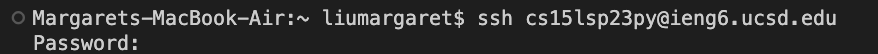
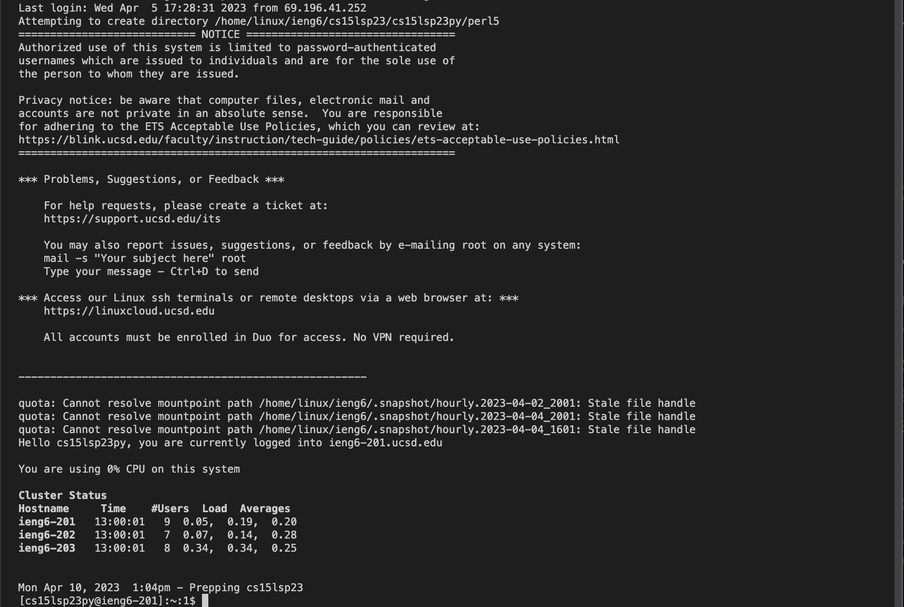
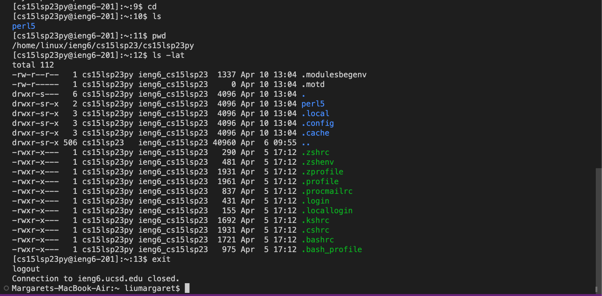

# Lab Report 1
*Directions:*
* have at least 3 screenshots (one for each of the steps below)
* each step include 2-3 sentences/bullet points describing what you did (if for some reason you didn't do the step exactly, describe why not; maybe your computer already had something on it, etc)
    1) Installing VScode
    2) Remotely Connecting
    3) Trying Some Commands

## Installing VSCode
1. Look up course-specific account for CSE15L at [Link](https://sdacs.ucsd.edu/~icc/index.php) and follow the instructions onscreen very carefully! ***make sure the username you put is your cse15l account and NOT your triton username***
2. Set up Visual Studio Code by going to the Visual Studio Code website [Link](https://code.visualstudio.com/) and follow the instructions to download and install on your computer
    - Once set up, you should get something that looks like this:

## Remotely Connecting
1. A mac should already have 'git' installed.
2. Open a terminal in VSCode (either Ctrl or Command + ', or Terminal --> New Terminal menu option) and use this command
    '''
    $ ssh cs15lsp23py@ieng6.ucsd.edu
    '''
    - where the 'py' is your own letters from your course-specific account

3. Type in your password and you should be logged into the remote server

## Trying Some Commands
1. Now you can run commands like:
    - 'cd' : 
    - 'ls' : 
    - 'pwd' :
    - 'mkdir' :
    - 'cp' :
    - 'ls -lat' :
    - Ctrl-D or 'exit' : to log out of the remote server in your terminal

