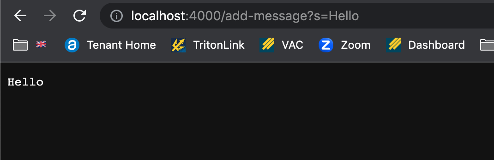
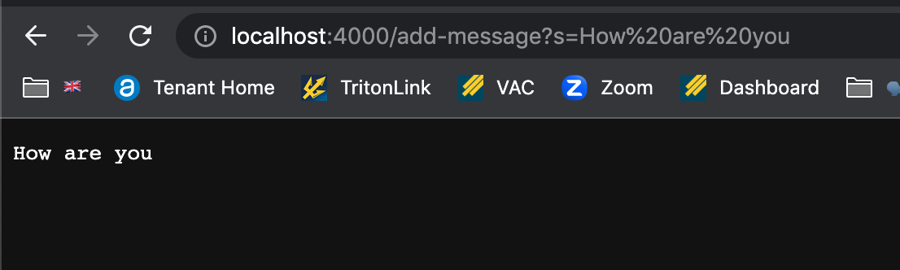
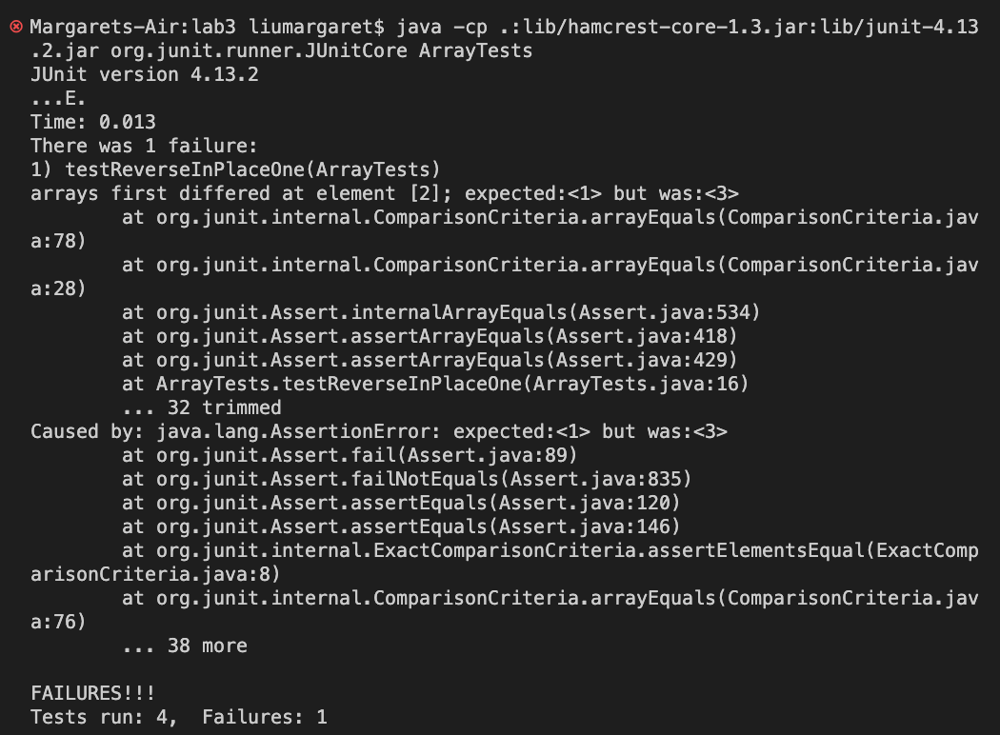

# Lab Report 2
Servers and Bugs (Week 3): In this lab, we practiced how to run tests using methods called 'assertEquals' and 'assertArrayEquals' and other 'assert...' methods. This way, we will be able to find out if there are any bugs in our code.

## Part 1
This is a webserver called 'StringServer' that keeps track of a single string that gets added to by incoming requests.
```
import java.io.IOException;
import java.net.URI;

class Handler implements URLHandler {
    public String handleRequest(URI url) {
        if (url.getPath().equals("/")) {
            return String.format("No messages");
        } else if (url.getPath().contains("/add")) {
            String[] messages = url.getQuery().split("=");
            return String.format(messages[1]);
        }
        else {return "404 Not Found!";}
    }
}

class StringServer {
    public static void main(String[] args) throws IOException {
        if(args.length == 0){
            System.out.println("Missing port number! Try any number between 1024 to 49151");
            return;
        }

        int port = Integer.parseInt(args[0]);

        Server.start(port, new Handler());
    }
}
```

* The method that was called was `handleRequest()` where the argument was the URL, and depending on what the URL included, the output would be that message.

* The method that was called was `handleRequest()`. This is the second message I added to the URL, however, the first message was replaced with the new message.

## Part 2
* A failure-inducing input for the bug in reverseInPlace()
```
@Test
  public void testReverseInPlaceOne() {
    int[] input2 = {1, 2, 3};
    ArrayExamples.reverseInPlace(input2);
    assertArrayEquals(new int[]{3, 2, 1}, input2);
  }
```
This input would show that the original code didn't actually reverse the input correctly. Since the int array replaces itself, the actual output does not equal the expected output.

* An input that *doesn't* induce a failure
```
@Test 
	public void testReverseInPlace() {
    int[] input1 = { 3 };
    ArrayExamples.reverseInPlace(input1);
    assertArrayEquals(new int[]{ 3 }, input1);
	}
```

* The symptom

This symptom showed that in the output int array, instead of the expected value <1>, the actual value was <3>, and instead of the expected value <3>, the actual value was <1>. This shows that the 'reverseInPlace' method was not actually able to reverse the input array.

* The bug
  *before*
  ```
  static void reverseInPlace(int[] arr) {
    for (int i = 0; i < arr.length; i += 1) {
      arr[i] = arr[arr.length - i - 1];
    }
  ```
  The bug in this code was the code inside the for loop. Because values are taken out of the array 'arr' and placed back into 'arr', the values of the array weren't properly reversed. The bug made it so that the value at index 0 is switched with the last value. However when it came to switching the value at the last index with the original value at index 0, the value found at index 0 is the one already switched.
  
  *after*
  ```
  static void reverseInPlace(int[] arr) {  
    int[] sub = new int[arr.length];
    for (int i = 0; i < arr.length; i++) {
      sub[i] = arr[i];
    }
    for(int i = 0; i < arr.length; i += 1) {
      System.out.println("index " + i + " = " + arr[i]);
      arr[i] = sub[arr.length - i - 1];
      System.out.println("changed " + arr[i]);
    }
  }
  ```
  This fixed the above issue by making sure that the values get properly switched. I made sure to store the input array into a separate array. Now in the for loop, the value taken to store into the input array will be from the separate array. This prevents the values from overlapping.
  
  ## Part 3
  Something that I learned during week 3 was about the different functions in the URL. I wasn't aware that certain letters or characters had a constant meaning, and depending on the placement of the words, they could mean different things. 

