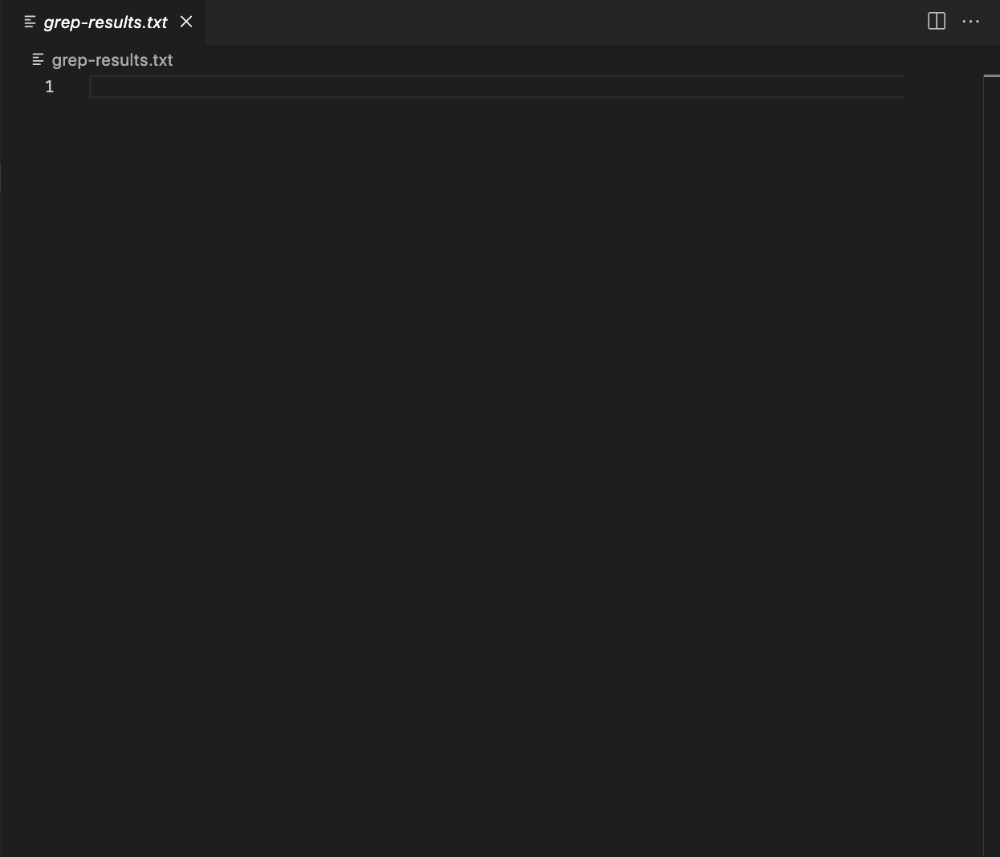
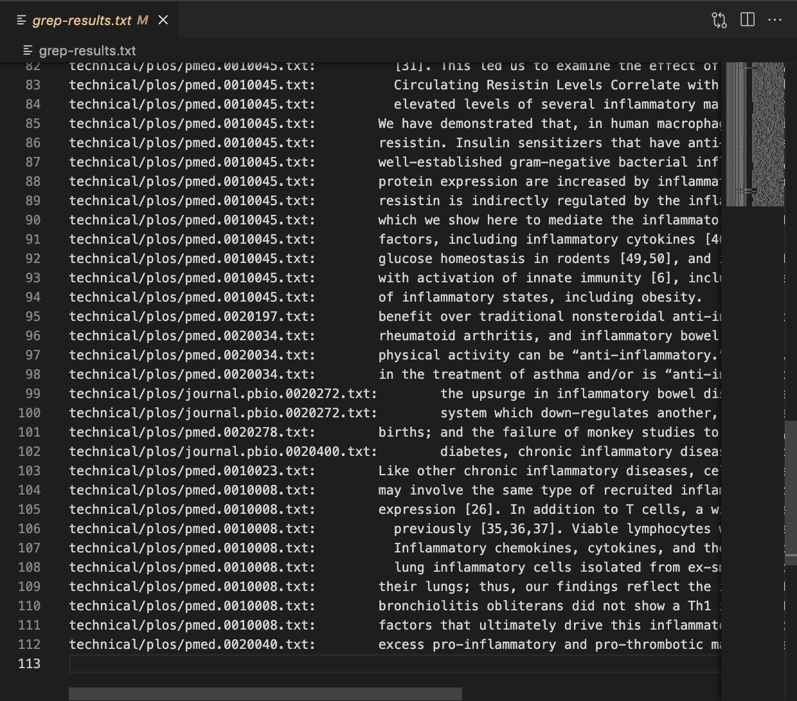
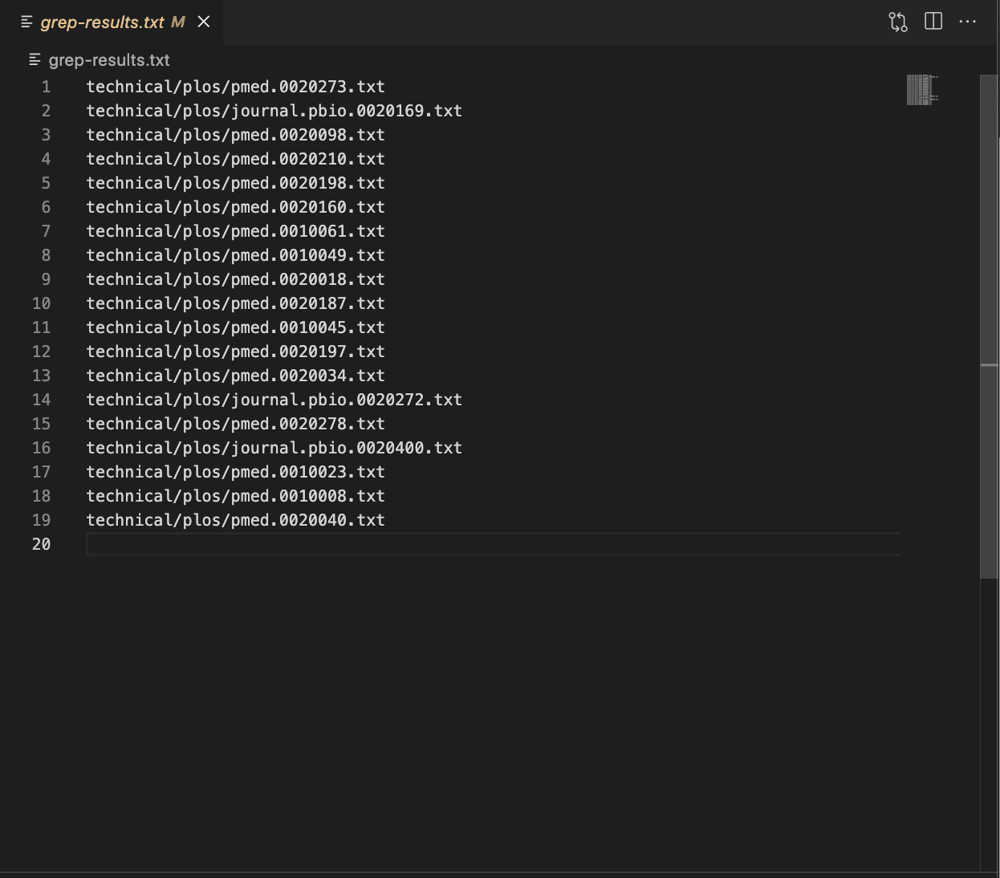
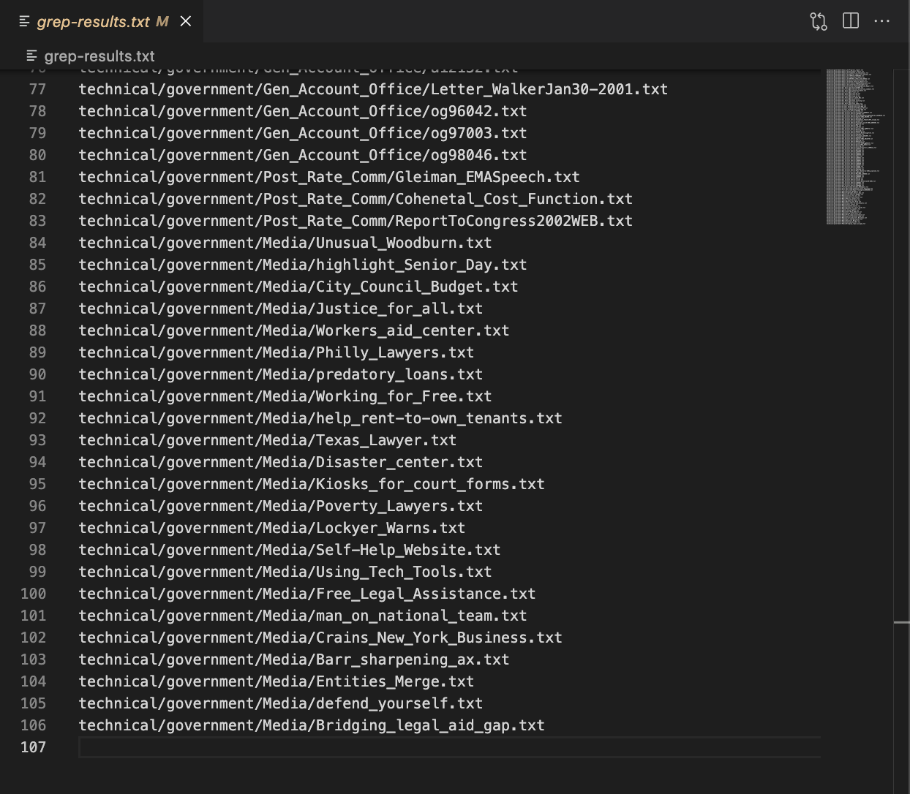
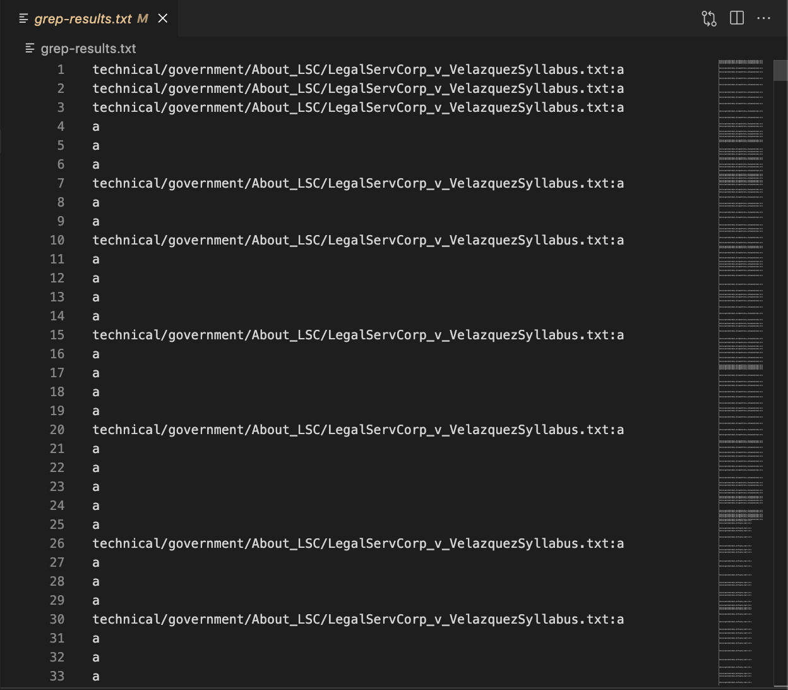
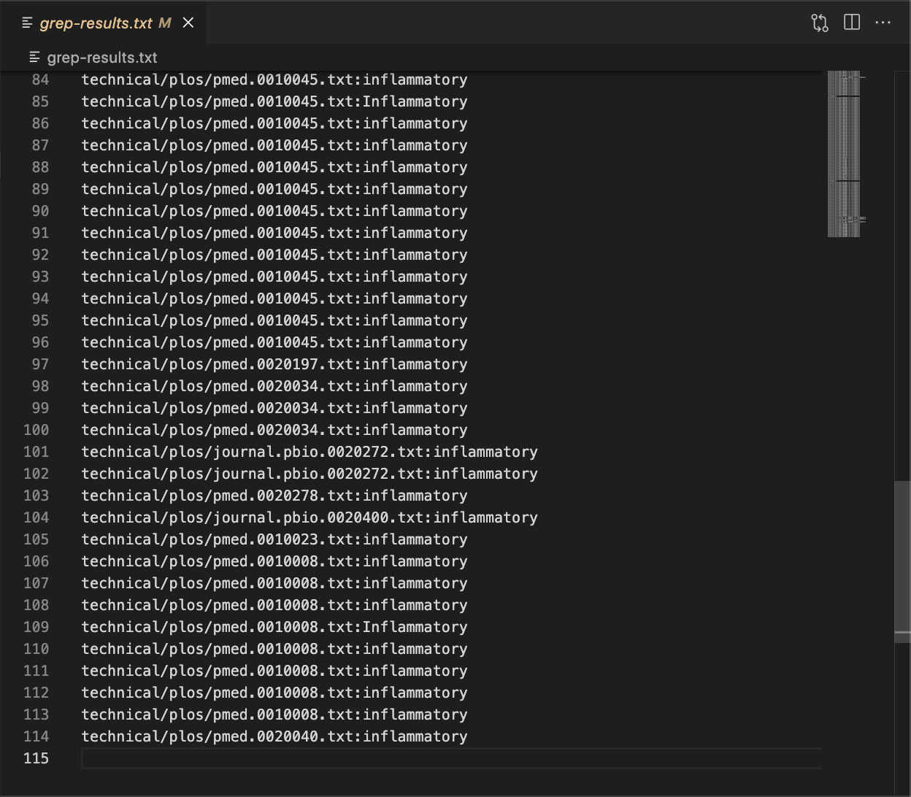
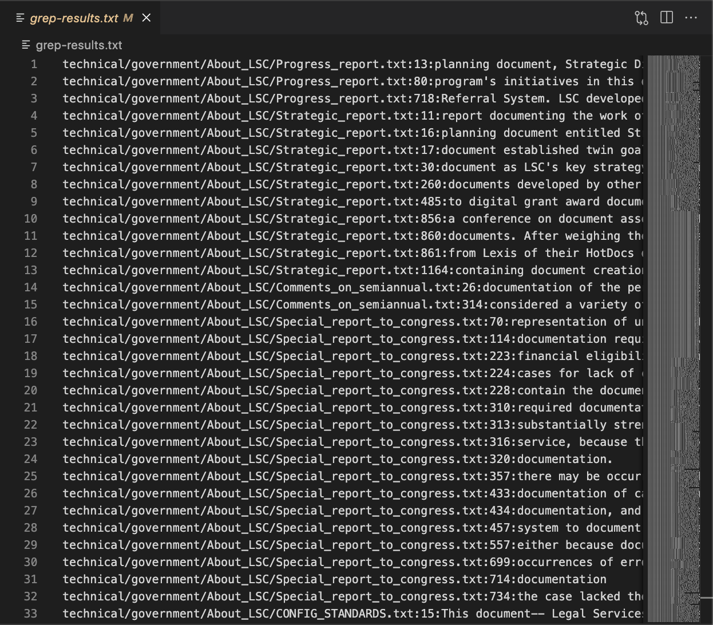

# Lab Report 3
I researched about the command `grep` and 4 of its options.

## `-i`
This option ignores uppercase and lowercase
```
grep -r "INFLAMMATORY" technical/plos > grep-results.txt
```

```
grep -r -i "INFLAMMATORY" technical/plos > grep-results.txt
```


## `-l`
This option outputs only the filenames of the matches, instead of the entire line containing the matched word.
```
grep -r -i -l "INFLAMMATORY" technical/plos > grep-results.txt
```

```
grep -r -l "document" technical/government > grep-results.txt
```


## `-o`
This option outputs only the matched parts of the matched line.
```
grep -r -o "a" technical/government > grep-results.txt
```

```
grep -r -i -o "INFLAMMATORY" technical/plos > grep-results.txt
```


## `-n`
This option precedes each matching line with a line number.
```
grep -r -n "document" technical/government > grep-results.txt
```

```
grep -r -i -o -n "INFLAMMATORY" technical/plos > grep-results.txt
```


