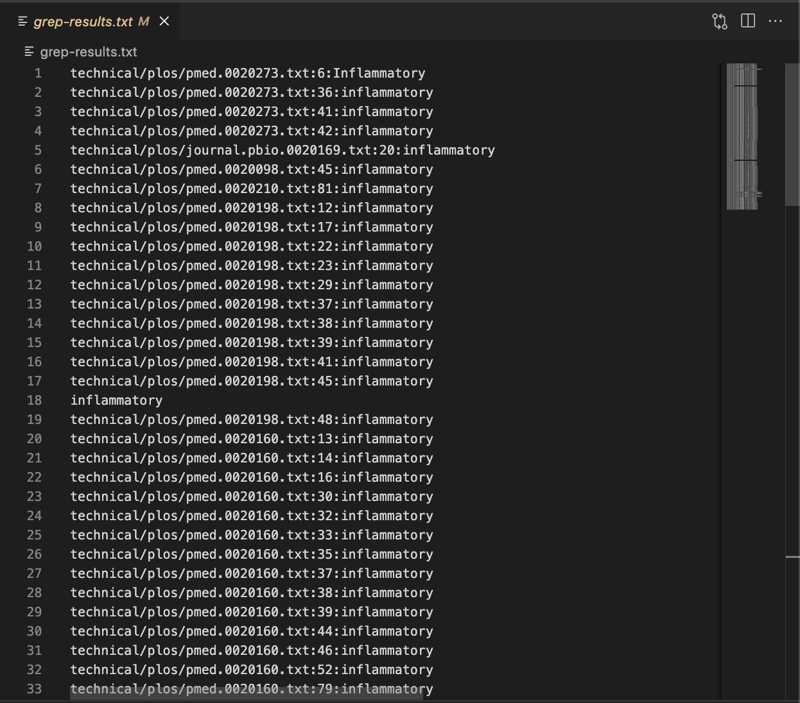

# Lab Report 3
I researched about the command `grep` and 4 of its options.

## `-i`
This option ignores uppercase and lowercase
```
grep -r "INFLAMMATORY" technical/plos > grep-results.txt
```
The line of code shows the result of what happens if I try to search exactly **INFLAMMATORY** with all caps in the files in *plos*. As shown in the screenshot below, there are zero results because none of the files has that exact word search.


```
grep -r -i "INFLAMMATORY" technical/plos > grep-results.txt
```
This example shows the result of what happens if I use `-i` along with **INFLAMMATORY**. In this case, the screenshot below shows numerous results. This means that the word search was for **inflammatory** regardless of case.


## `-l`
This option outputs only the filenames of the matches, instead of the entire line containing the matched word.
```
grep -r -i -l "INFLAMMATORY" technical/plos > grep-results.txt
```
This example is to comparison with the second example from `-i` command. The only difference in the code is `-l`, and as seen in the screenshot below, only the file names are shown. The matched lines aren't included in the output.


```
grep -r -l "document" technical/government > grep-results.txt
```
This is another example of `-l` where the output, shown in the screenshot below, are the file names containing the matched lines with **document**.


## `-o`
This option outputs only the matched parts of the matched line.
```
grep -r -o "a" technical/government > grep-results.txt
```
In the screenshot below, it shows that the only output following the file names is the searched key word **a**. Unlike before, the entire matched line isn't included in the output; instead only the parts of the line that actually consist of the matching word.


```
grep -r -i -o "INFLAMMATORY" technical/plos > grep-results.txt
```
This example shows a comparison to one of the examples above. Before, the output following the file name would be long because it is the matched line. Now, the only thing that follows the file names is **inflammatory**, disregarding letter case.


## `-n`
This option precedes each matching line with a line number.
```
grep -r -n "document" technical/government > grep-results.txt
```
This example shows that by adding `-n` to the code, there are line numbers that now go after the file names and precede the matched line.


```
grep -r -i -o -n "INFLAMMATORY" technical/plos > grep-results.txt
```
In comparison to above examples, this example includes the line numbers of where the matched parts are. While there are no matched lines because of `o`, there are now numbers before each **inflammatory**, regardless of case, because of `-n`.



