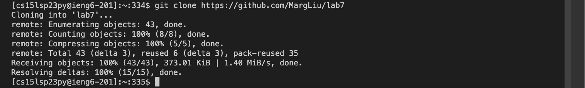
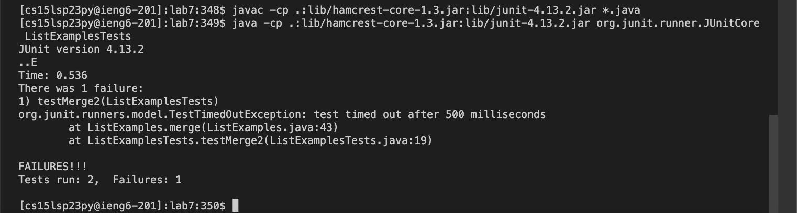
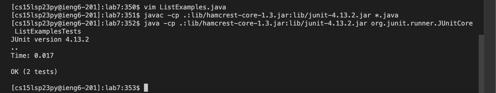
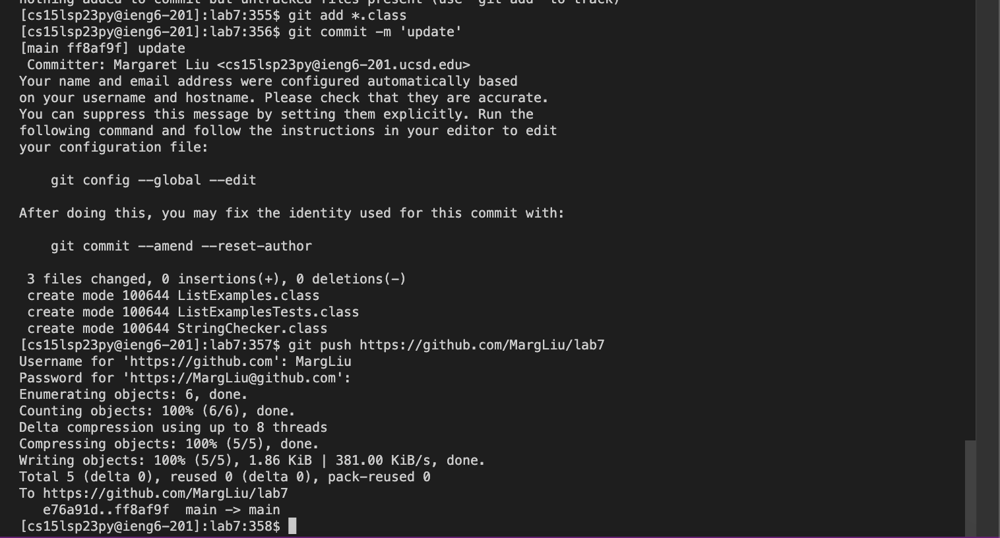

#Lab 4

##Step 5

```
git clone https://github.com/MargLiu/lab7
cd lab7
```
Following the steps, I first clone the repository from my github page using the URL. I then change directly into *lab7*.

##Step 6

```
javac -cp .:lib/hamcrest-core-1.3.jar:lib/junit-4.13.2.jar *.java
java -cp .:lib/hamcrest-core-1.3.jar:lib/junit-4.13.2.jar org.junit.runner.JUnitCore ListExamplesTests
```
I first compile all the *.java* files in the directory, and then I run the tests. As shown in the screenshot, it shows that there's a failed test.

##Step 7 & Step 8

```
vim ListExamples.java
/while(index2 [enter]
jjes2 [esc]
:wq!
```
I first complete **step 7** by going into *ListExamples.java* using `vim`. I then search directory for `while( index2`, which puts the cursor near the bug. I then have to go down two lines in order to change the actual bug (from `index1` to `index2`), and save and exit.

```
<up> <up>
javac -cp .:lib/hamcrest-core-1.3.jar:lib/junit-4.13.2.jar *.java
<up> <up>
java -cp .:lib/hamcrest-core-1.3.jar:lib/junit-4.13.2.jar org.junit.runner.JUnitCore ListExamplesTests
```
I have to go up because the compile command was two up in the history. I do the same thing for the run command.

##step 9

```
git add *.class
git commit -m 'update'
git push https://github.com/MargLiu/lab
```
After seeing that the bug is fixed and all the tests passed, I first add all the new files, which are the *.class* files. I then commit the firectory with the message `update`. Finally, I push the changes to the repository on my github page.
