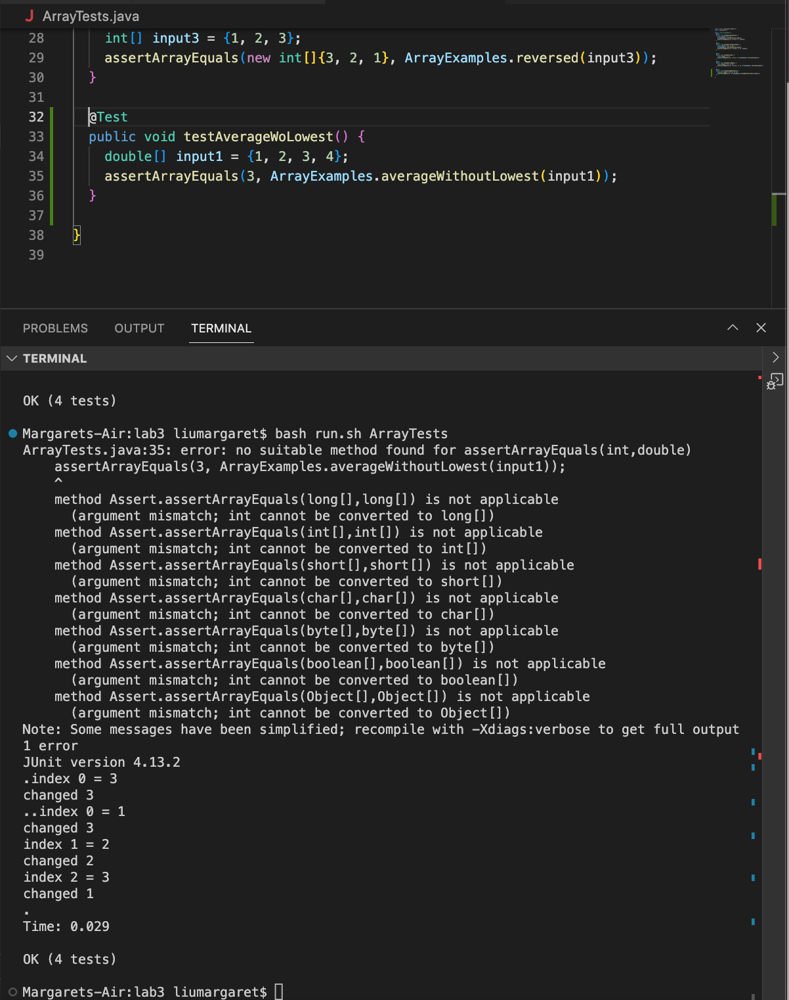
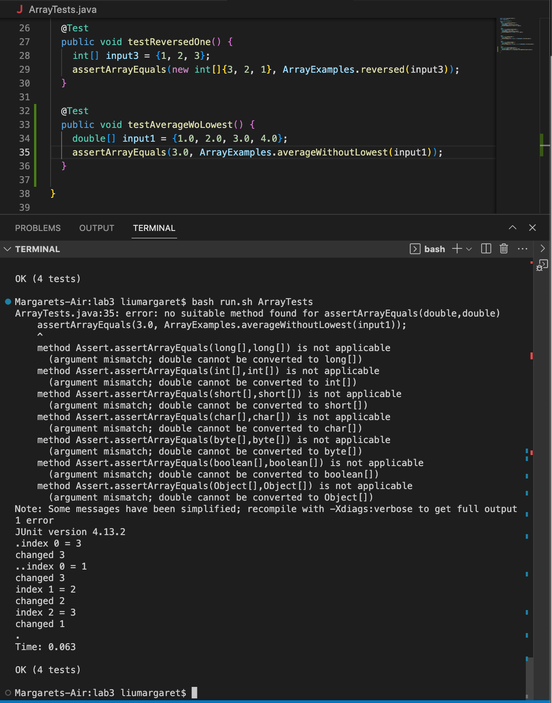

# Lab 5

## Student's post on Ed Discussion
**What environment are you using (computer, operating system, web browser, terminal/editor, and so on)?**

I am on my computer using VSCode.

**Detail the symptom you're seeing. Be specific; include both what you're seeing and what you expected to see instead. Screenshots are great, copy-pasted terminal output is also great. Avoid saying “it doesn't work”.**

I am writing tests for the method `averageWithoutLowest(double[] arr)`, and the test outputs this error instead.

**Detail the failure-inducing input and context. That might mean any or all of the command you're running, a test case, command-line arguments, working directory, even the last few commands you ran. Do your best to provide as much context as you can.**

The method is supposed to average the numbers in the array, but leaves out the lowest number when calculating. Returns 0 if there are no elements or just 1 element in the array. Because average results are not always integers, the input of the method is a `double` and the output is also a `double`.

## "TA's" response to above post
Double check on what you have written as int and what you have as double. How do you differentiate a number as being an int compared to being a double?

## After Fixing Mistake
*Tried the TA's suggestion in changing the numbers written as int into numbers written as double*

## Reflection
I feel that during the second half of the quarter, I was able to understand the importance and usefulness of bash script. When it was first introduced in the quarter, I simply thought that bash script was something that is used as a shortcut to make writing commands in the terminal easier. During the second half, I found out that bash script could do so much more. We learned that it could be it's very own Autograder.

